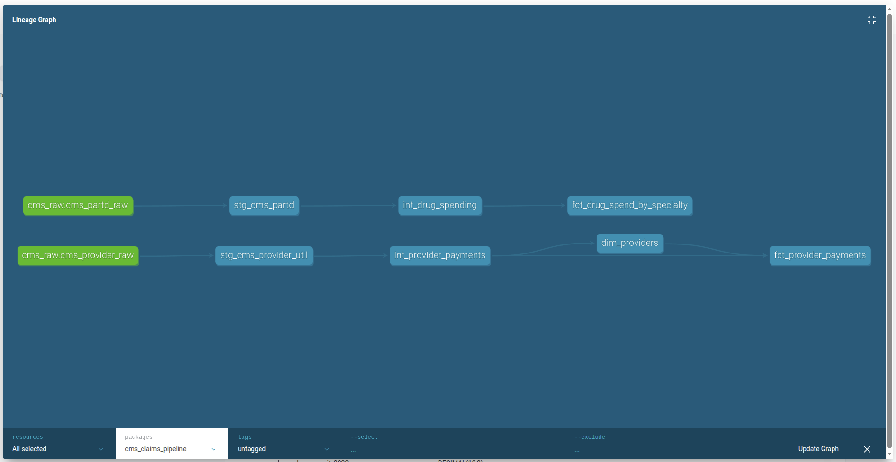

# CMS Claims Pipeline

A full medallion architecture data pipeline built on public CMS Medicare data using dbt Core and DuckDB. Zero PHI. Fully reproducible locally.

## Architecture


```
Raw CMS Files (CSV)
      ↓
 Bronze Layer (views)
 stg_cms_partd | stg_cms_provider_util
      ↓
 Silver Layer (tables)
 int_drug_spending | int_provider_payments
      ↓
 Gold Layer (tables)
 dim_providers | fct_provider_payments | fct_drug_spend_by_specialty
      ↓
 Evidence.dev Dashboard
```

## Datasets

| Dataset | Source | Rows |
|---|---|---|
| Medicare Part D Drug Spending 2019-2023 | data.cms.gov | 14,309 |
| Medicare Provider Utilization & Payment 2023 | data.cms.gov | 9,660,647 |

## Stack

| Layer | Tool |
|---|---|
| Ingestion | Python + DuckDB |
| Storage | DuckDB (local) |
| Transformation | dbt Core 1.11.6 |
| Testing | dbt built-in + dbt-expectations |
| Documentation | dbt docs |
| Dashboard | Evidence.dev |

## What's Built

- **Bronze** — 2 staging models, sources declared, 8 tests
- **Silver** — 2 intermediate models, type casting, null handling, specialty code enrichment via seed, 14 tests
- **Gold** — 1 dimension table, 2 fact tables, star schema, 19 tests
- **Snapshot** — SCD Type 2 on provider payment data
- **Seed** — specialty code lookup table
- **Macro** — `safe_divide` reusable across models
- **Packages** — dbt-utils, dbt-expectations
- **Total** — 50/50 `dbt build` passing

## Running Locally
```bash
# Clone and set up
git clone https://github.com/anZro/cms-claims-pipeline.git
cd cms-claims-pipeline
python3 -m venv venv
source venv/bin/activate
pip install -r requirements.txt

# Download CMS datasets from data.cms.gov into data/raw/
# Medicare Part D Drug Spending
# Medicare Provider Utilization & Payment

# Load raw data into DuckDB
python ingest.py

# Run the pipeline
cd cms_claims_pipeline
dbt build

# View docs and lineage
dbt docs generate
dbt docs serve
```

## Key dbt Concepts Demonstrated

- Medallion architecture (bronze/silver/gold)
- Sources and staging patterns
- `ref()` and `source()` for DAG lineage
- All four materializations (view, table, incremental-ready, snapshot)
- Built-in tests: `not_null`, `unique`, `accepted_values`, `relationships`
- dbt-expectations: row count, column value range tests
- SCD Type 2 via dbt snapshots
- Seeds for reference data
- Custom macros
- Model tags and subset selectors
- dbt packages via `packages.yml`
- Full lineage graph from raw source to gold marts
